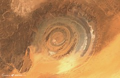
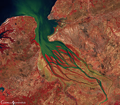
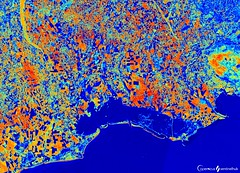

						

							<a href="Agriculture">
								
								
Agriculture

							</a>
						

						

							<a href="{theme_path}">
								
								
Atmosphere and Air Pollution

							</a>
						

						

							<a href="Change_Detection_Through_Time">
								
								
Change Detection Through Time

							</a>
						

						

							<a href="Floods_and_Droughts">
								
								
Floods and Droughts

							</a>
						

						

							<a href="Geology">
								
								
Geology

							</a>
						

